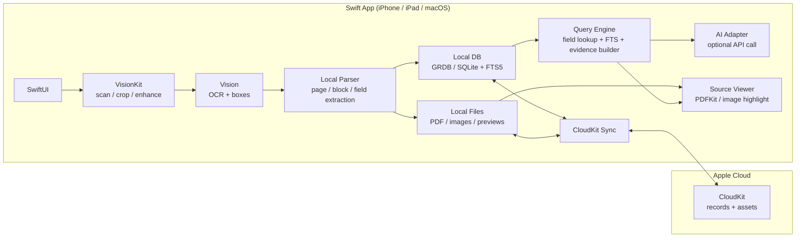
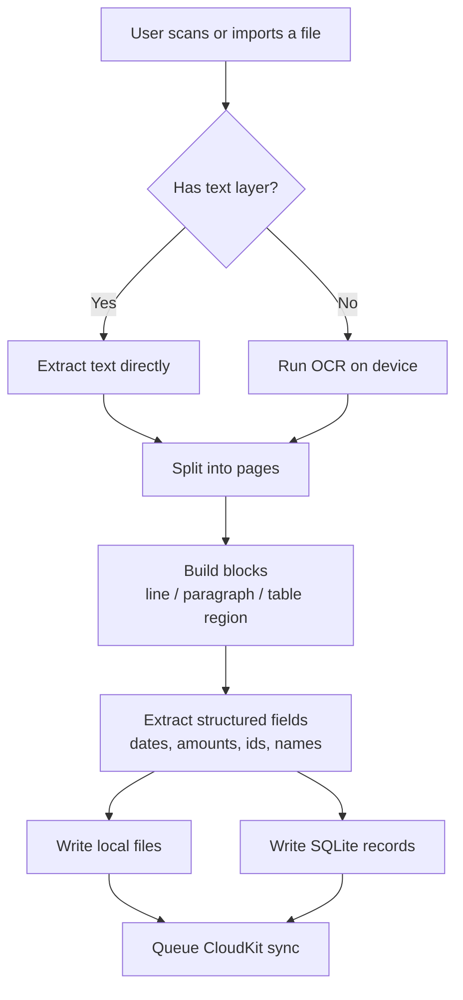
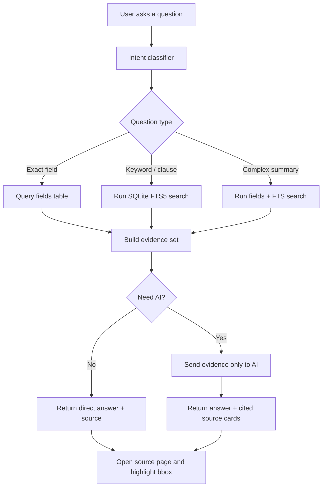

# Apple-only Document Copilot MVP

## 1. Product Positioning

This MVP is an `Apple-only`, `local-first`, `CloudKit-synced` document copilot.

Goals:

- Ship a useful first version without maintaining a full custom backend.
- Keep document scanning, OCR, parsing, indexing, and source-location mostly on device.
- Use AI only as the final reasoning layer after deterministic retrieval.
- Preserve a migration path to a future enterprise backend.

Non-goals for this MVP:

- Enterprise multi-tenant permissions
- Team collaboration ACL
- Android support
- IM agent integration as a first-class server API

---

## 2. Core Principles

1. `Documents are stored locally first`, then synced through `CloudKit`.
2. `Search is deterministic first`, AI second.
3. `Structured fields` should be extracted before general semantic answering.
4. `Source grounding` must be preserved from ingestion to answer.
5. `Local OCR and local indexing` are preferred to reduce API cost.

---

## 3. High-level Architecture

---

## 4. Ingestion Data Flow

---

## 5. Query Flow

---

## 6. Best-practice Workflow

### 6.1 Ingestion

1. Import or scan document
2. Normalize file name and metadata
3. Produce page-level assets
4. OCR if needed
5. Store text with page-level and block-level coordinates
6. Extract deterministic fields
7. Build local FTS index
8. Sync records and assets to CloudKit

### 6.2 Answering

1. Detect whether the question is a field lookup or a content lookup
2. Search `fields` first
3. If not enough, search `blocks` through FTS5
4. Build a small evidence set with `page_no`, `snippet`, and `bbox`
5. Only then call the AI model
6. Return citations that open the exact page region

### 6.3 Why this workflow is best for MVP

- It is cheaper than sending whole documents to AI.
- It gives deterministic answers for dates, ids, and amounts.
- It supports source highlighting from day one.
- It works offline for search if the document is already on device.
- It leaves room for a future backend without rewriting the app UX.

---

## 7. Minimal Local Data Model

### 7.1 documents

- `id`
- `title`
- `document_type`
- `source_type`
- `created_at`
- `updated_at`
- `page_count`
- `file_local_path`
- `cloudkit_record_name`
- `checksum`

### 7.2 pages

- `id`
- `document_id`
- `page_no`
- `image_local_path`
- `text`
- `width`
- `height`
- `cloudkit_record_name`

### 7.3 blocks

- `id`
- `document_id`
- `page_id`
- `page_no`
- `block_type`
- `text`
- `normalized_text`
- `bbox_x`
- `bbox_y`
- `bbox_w`
- `bbox_h`
- `confidence`

### 7.4 fields

- `id`
- `document_id`
- `page_no`
- `field_name`
- `field_value`
- `normalized_value`
- `confidence`
- `bbox_x`
- `bbox_y`
- `bbox_w`
- `bbox_h`

### 7.5 reminders

- `id`
- `document_id`
- `field_name`
- `trigger_date`
- `status`

### 7.6 search index

Use `SQLite FTS5` over:

- `documents.title`
- `pages.text`
- `blocks.text`
- selected `fields.field_value`

---

## 8. Retrieval Strategy

### 8.1 Field-first retrieval

Use for:

- "What is my passport number?"
- "When does this expire?"
- "What is the penalty amount?"

Preferred logic:

1. Match likely field names
2. Rank by document recency and confidence
3. Return exact value plus source region

### 8.2 FTS-first retrieval

Use for:

- "Where does it mention early termination?"
- "Find the clause about deposit refund"

Preferred logic:

1. Search `blocks`
2. Rank by BM25 and title match
3. Merge adjacent hits on the same page
4. Return snippets with source cards

### 8.3 AI-assisted retrieval

Use for:

- "Summarize the renewal terms"
- "Compare these two leases"

Preferred logic:

1. Gather top evidence blocks
2. Send only those blocks to the model
3. Force answer grounded in evidence
4. Return citations for every answer

---

## 9. Local vs Cloud Responsibility

### 9.1 Run locally

- Camera scan
- Image cleanup
- OCR
- Page splitting
- Field extraction
- Local file storage
- Local search
- Source highlight rendering
- Reminder scheduling

### 9.2 Sync through CloudKit

- Document metadata
- Page metadata
- Block text
- Field values
- File assets
- Reminder metadata

### 9.3 Use external AI only when needed

- Long-form question answering
- Multi-document comparison
- Ambiguous extraction fallback

---

## 10. Recommended Open Source Components

### 10.1 Strongly recommended

- `GRDB.swift`
  - Best fit for local SQLite access in Swift.
  - Repo: <https://github.com/groue/GRDB.swift>

- `SQLite FTS5`
  - Built-in full-text search engine.
  - Docs: <https://sqlite.org/fts5.html>

### 10.2 Useful references

- `apple/sample-cloudkit-coredatasync`
  - Reference for CloudKit sync architecture.
  - Repo: <https://github.com/apple/sample-cloudkit-coredatasync>

- `apple/sample-cloudkit-sync-engine`
  - Reference for manual sync control.
  - Repo: <https://github.com/apple/sample-cloudkit-sync-engine>

- `OCRmyPDF`
  - Good reference for searchable PDF generation on desktop import.
  - Repo: <https://github.com/ocrmypdf/OCRmyPDF>

- `Docling`
  - Good reference for future server-side document grounding.
  - Repo: <https://github.com/docling-project/docling>

### 10.3 Not recommended for day-one mobile embedding

- Large local vector databases
- On-device LLM RAG stacks
- Server-style PDF parsing frameworks on iPhone

---

## 11. Suggested Xcode Project Shape

Create the project now. Do not wait.

Recommended modules:

- `App`
  - SwiftUI app entry, navigation, environment
- `Features`
  - Scan, Library, Ask, Document Detail, Settings
- `Services`
  - OCRService, ParserService, QueryService, ReminderService
- `Storage`
  - GRDB database, repositories, migrations
- `Sync`
  - CloudKit sync adapter
- `Models`
  - document, page, block, field, reminder
- `UIComponents`
  - shared cards, source chips, highlight overlays

Recommended first screens:

1. Document library
2. Scan/import flow
3. Document detail with extracted fields
4. Ask screen with source cards

---

## 12. First Build Order

### Phase 1

- Create Xcode project
- Set up local DB
- Build scan/import flow
- Save document and page records

### Phase 2

- Add OCR
- Add block extraction
- Add field extraction
- Render source highlight on page

### Phase 3

- Add FTS search
- Add question classifier
- Add direct field answers

### Phase 4

- Add optional AI answer step
- Add citation cards
- Add CloudKit sync

---

## 13. Honest Product Call

For this Apple-only MVP, the best workflow is:

`scan/import -> OCR -> blocks/fields -> local search -> evidence -> optional AI -> cited answer`

This is better than:

- sending full files to AI
- trying to do vector search first
- trying to avoid all local structure
- trying to design the enterprise backend now

It keeps cost low, keeps the product fast, and still matches the user experience you want.
